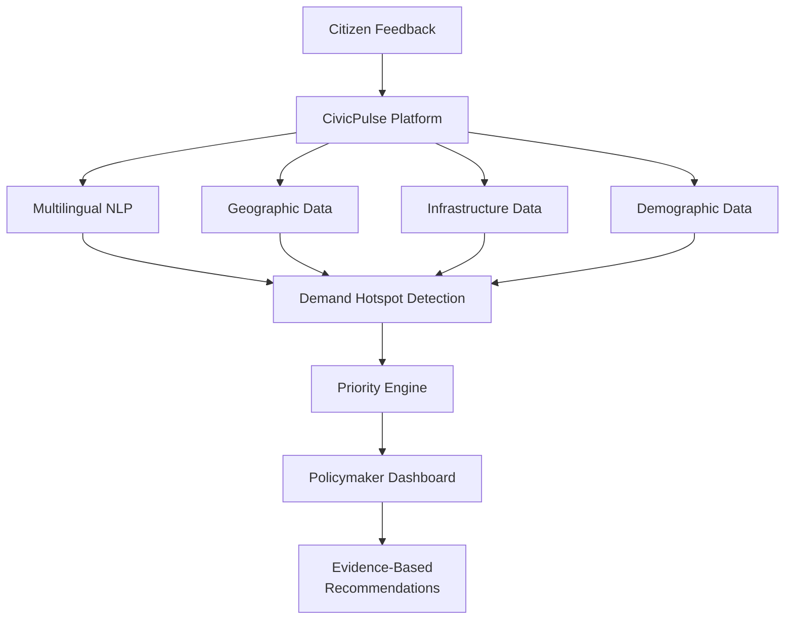
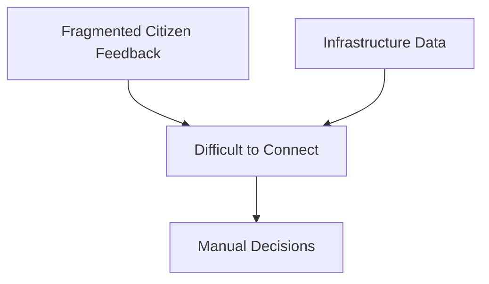
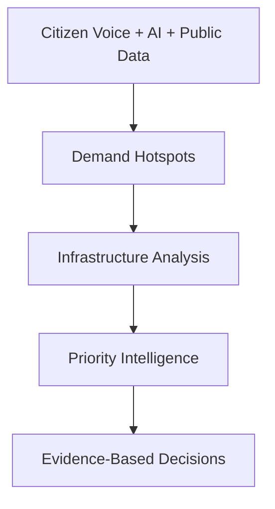

CivicPulse
==========

### Turning Citizen Voice into Evidence-Backed Infrastructure Priorities

> Every citizen a data point. Every priority, provable.

CivicPulse is an AI-enabled civic infrastructure intelligence platform designed to transform fragmented, multilingual citizen feedback into actionable, data-informed infrastructure priorities.

Built for the BRICS Innovation Challenge — Track 1: AI for Digital Public Infrastructure & Governance.

Overview
--------

Citizens continuously report problems related to:

*   Roads
    
*   Water supply
    
*   Sanitation
    
*   Electricity
    
*   Public transportation
    
*   Waste management
    
*   Other public infrastructure
    

However, citizen feedback is often:

*   Fragmented across different channels
    
*   Submitted in multiple languages
    
*   Difficult to aggregate geographically
    
*   Separated from infrastructure and demographic data
    
*   Difficult for policymakers to convert into investment priorities
    

CivicPulse is designed to bridge this gap by connecting citizen voice, AI, geographic demand, infrastructure conditions, demographics, and investment information in one decision-support platform.

### Core Concept

Citizen Feedback → Multilingual Understanding → Demand Hotspots → Infrastructure Data → Priority Scoring → Evidence-Based Recommendations

Product Vision
==============

CivicPulse provides policymakers with a unified intelligence layer for understanding:

*   Where infrastructure demand is highest
    
*   What citizens are complaining about
    
*   Which districts require the most attention
    
*   Where infrastructure gaps exist
    
*   How planned investment compares with citizen demand
    
*   Why one region should be prioritized over another
    

The goal is not to replace policymakers.

The goal is to provide policymakers with a clearer, more transparent signal of where citizen needs are greatest.

UI/UX Prototype
===============

The current prototype focuses on creating a minimalist, elegant, and data-centric policymaker experience.

Rather than presenting CivicPulse as a generic AI chatbot, the interface is designed as a professional GovTech / Digital Public Infrastructure intelligence platform.

Design Principles
-----------------

PrincipleApproachMinimalismClean layouts and purposeful componentsClarityStrong visual hierarchyData-firstInformation is presented before decorationAccessibilityClear typography and intuitive navigationEvidence-firstRecommendations can be traced to supporting signalsProfessionalDesigned for a policymaker-oriented environmentRestraintLimited colors, shadows, and animations

Visual Language
---------------

*   Deep navy navigation
    
*   White and off-white surfaces
    
*   Muted blue and teal accents
    
*   Amber for higher-priority signals
    
*   Red for critical issues
    
*   Clean typography
    
*   Subtle borders and shadows
    
*   Compact data cards
    
*   Interactive geographic visualization
    

Product Preview
===============

Dashboard
---------

The CivicPulse dashboard provides a unified view of citizen demand, geographic hotspots, infrastructure conditions, and priority regions.

Add your screenshot here:

Core Screens
============

01 — Dashboard
--------------

The executive overview of CivicPulse.

Provides:

*   Key performance indicators
    
*   Geographic hotspot map
    
*   Priority region ranking
    
*   Current region context
    
*   Data status
    
*   Quick access to deeper analysis
    

02 — Demand Hotspots
--------------------

The Demand Hotspots view focuses on the geographic concentration of citizen complaints.

The central question is:

> Where are citizens experiencing the highest concentration of infrastructure problems?

Hotspot intensity can represent complaint density, while priority tiers communicate urgency.

03 — Priority Regions
---------------------

A ranked view of regions requiring attention.

Example prototype ranking:

RankRegionInfrastructure IssuePriority01District AWater & Sanitation0.9102District BRoad Connectivity0.8603District CPower Reliability0.7904District DPublic Transit0.71

These values represent the prototype concept and are not official government statistics.

04 — Citizen Feedback
---------------------

A dedicated interface for exploring citizen complaints.

The intended experience supports:

*   Complaint search
    
*   Language filtering
    
*   District filtering
    
*   Infrastructure category filtering
    
*   Original citizen feedback
    
*   Complaint inspection
    
*   Geographic association
    

CivicPulse is designed to support multilingual citizen feedback rather than requiring every citizen to communicate in a single language.

05 — Infrastructure
-------------------

The Infrastructure view provides a district-level perspective of infrastructure conditions.

Potential indicators include:

*   Water access
    
*   Sanitation
    
*   Road quality
    
*   Electricity reliability
    
*   Public transportation
    
*   Infrastructure gap
    
*   Planned investment
    

06 — Analytics
--------------

The Analytics experience provides deeper insight into the underlying signals.

Potential visualizations include:

*   Complaint trends
    
*   Infrastructure gaps
    
*   Complaint categories
    
*   Priority distribution
    
*   Language distribution
    
*   District comparisons
    

CivicPulse AI Pipeline
======================

The CivicPulse concept follows five major stages:

Citizen Feedback↓Ingest↓Normalize↓Cluster↓Fuse↓Prioritize↓Evidence-Based Recommendations

01 — Ingest
-----------

Collect citizen feedback through digital channels.

02 — Normalize
--------------

Use multilingual NLP representations to bring feedback from different languages into a common analytical space.

03 — Cluster
------------

Group related complaints according to topic and geography.

04 — Fuse
---------

Combine citizen demand hotspots with infrastructure, demographic, and investment information.

05 — Prioritize
---------------

Generate a ranked list of regions requiring attention.

CivicPulse Priority Intelligence
================================

The central concept of CivicPulse is the Priority Score.

Proposed Scoring Model
----------------------

Priority Score = w₁ × Complaint Density + w₂ × Infrastructure Gap − w₃ × Planned Investment

The model is designed to prioritize regions where:

1.  Citizen demand is high
    
2.  Existing infrastructure is weak
    
3.  Planned investment does not sufficiently close the infrastructure gap
    

The scoring approach is intended to remain interpretable and auditable.

Evidence-Based Decisions
========================

CivicPulse follows one core principle:

> A recommendation should be explainable.

Instead of simply showing:

District APriority Score: 0.91

the intended experience should explain why.

### Example

EvidenceValueCitizen Demand1,284 complaintsTop IssueWater & SanitationInfrastructure Gap0.78Planned InvestmentLowPriority Score0.91

This allows policymakers to trace a recommendation back to the evidence behind it.

Multilingual by Design
======================

Infrastructure problems are not limited to one language.

CivicPulse is designed to accept citizen feedback across multiple languages and normalize those signals into a common analytical representation.

### Example

English:

Water supply has been unreliable.

Hindi:

पानी की सप्लाई ठीक नहीं है।

Regional Language:

Citizen infrastructure complaint

The intended AI layer can use multilingual embeddings to identify semantically related complaints even when they are written in different languages.

# Product Architecture

The current repository primarily represents the **UI/UX prototype**.

The intended full platform architecture is designed around five major layers: **Citizen Feedback, AI/NLP Processing, Public Data Integration, Priority Intelligence, and the Policymaker Dashboard.**



### Architecture Layers

| Layer | Purpose |
|---|---|
| Citizen Feedback | Collect infrastructure complaints and citizen signals |
| Multilingual NLP | Normalize and understand feedback across languages |
| Geographic Data | Identify location-based demand patterns |
| Infrastructure Data | Evaluate infrastructure conditions and gaps |
| Demographic Data | Provide regional demographic context |
| Demand Hotspot Detection | Identify geographically concentrated demand |
| Priority Engine | Combine signals into regional priority scores |
| Policymaker Dashboard | Present insights and recommendations |
| Evidence-Based Recommendations | Support transparent infrastructure decisions |

> **Architecture Note:** The AI processing, infrastructure fusion, demand hotspot detection, and priority engine represent the intended intelligence layer and future expansion of the current UI/UX prototype.

# Technology Direction

The CivicPulse platform is designed to evolve into a scalable full-stack AI system.

## Technology Stack

| Layer | Technology | Purpose |
|---|---|---|
| Frontend | React / TypeScript | Build the interactive web application |
| UI | Tailwind CSS | Responsive and consistent interface design |
| Build Tool | Vite | Fast development and production builds |
| Visualization | Recharts | Charts and analytical visualizations |
| Maps | Leaflet / OpenStreetMap | Geographic visualization and hotspot mapping |
| Backend | FastAPI | Future API and backend services |
| Data Processing | Python / Pandas | Data processing and transformation |
| AI / NLP | Multilingual Embeddings | Multilingual semantic understanding |
| Analytics | Scikit-learn | Clustering and analytical processing |
| Future Database | PostgreSQL | Scalable structured data storage |

### Architecture by Technology

```text
Frontend
React / TypeScript
        │
        ▼
Tailwind CSS + Vite
        │
        ├──────────────► Recharts
        │
        └──────────────► Leaflet / OpenStreetMap
                              │
                              ▼
                         CivicPulse UI
                              │
                              ▼
                         Future Backend
                              │
                         FastAPI / Python
                              │
                ┌─────────────┼─────────────┐
                ▼             ▼             ▼
        Multilingual       Data          Analytics
            NLP          Processing      / ML
                │             │             │
                └─────────────┼─────────────┘
                              ▼
                         PostgreSQL
```

> **Current Status:** The current repository primarily focuses on the **frontend UI/UX prototype**. Backend services, AI/NLP processing, advanced analytics, and database integration represent the planned expansion of the platform.


Prototype Scope
===============

The current prototype focuses on the product experience and visual workflow.

### Current Prototype

*   Dashboard
    
*   Demand Hotspots
    
*   Priority Regions
    
*   Citizen Feedback
    
*   Infrastructure View
    
*   Analytics
    
*   Interactive Map
    
*   Policymaker-oriented UX
    
*   Demo Mode
    
*   Priority scoring concept
    

### Intelligence Layer

*   Multilingual NLP
    
*   Semantic Embeddings
    
*   Complaint Clustering
    
*   Infrastructure Fusion
    
*   Dynamic Priority AI
    
*   Voice Input
    
*   WhatsApp / SMS
    

> Prototype Disclaimer: The interface may use representative or simulated data and should not be interpreted as an official deployment of government infrastructure data.

Current Status
==============

# UI/UX Prototype — In Development

The current CivicPulse prototype focuses on the core policymaker experience, dashboard design, geographic visualization, and product workflow.

## Implementation Status

| Component | Status |
|---|---|
| Dashboard | ✅ Implemented |
| Demand Hotspots | 🟡 Prototype |
| Priority Regions | 🟡 Prototype |
| Citizen Feedback | 🟡 Prototype |
| Infrastructure View | 🟡 Prototype |
| Analytics | 🟡 Prototype |
| Interactive Map | ✅ Implemented |
| Policymaker UX | ✅ Implemented |
| Multilingual NLP | 🔵 Planned |
| Semantic Embeddings | 🔵 Planned |
| Complaint Clustering | 🔵 Planned |
| Infrastructure Fusion | 🔵 Planned |
| Dynamic Priority AI | 🔵 Planned |
| Voice Input | 🔵 Planned |
| WhatsApp / SMS | 🔵 Planned |

### Status Legend

- ✅ **Implemented** — Currently available in the prototype
- 🟡 **Prototype** — UI/UX experience demonstrated with prototype data
- 🔵 **Planned** — Part of the future intelligence/scaling roadmap

> **Note:** The current repository primarily represents the CivicPulse UI/UX prototype. AI/NLP processing, automated clustering, infrastructure fusion, dynamic priority scoring, and voice/messaging integrations are planned for future iterations.

Future Roadmap
==============

NOW — Prototype
---------------

*   Single-region experience
    
*   Text-based citizen feedback
    
*   Multilingual UI concept
    
*   Geographic hotspot visualization
    
*   Priority ranking
    
*   Infrastructure intelligence dashboard
    

NEXT — Voice & Messaging
------------------------

*   Voice complaint ingestion
    
*   IVR integration
    
*   WhatsApp integration
    
*   SMS support
    
*   Low-connectivity workflows
    

THEN — Full Multilingual Coverage
---------------------------------

*   Additional regional languages
    
*   Expanded multilingual NLP models
    
*   Voice-language processing
    
*   Improved semantic clustering
    

SCALE — Cross-BRICS Deployment
------------------------------

*   Country-specific data adapters
    
*   Regional infrastructure datasets
    
*   Pluggable demographic sources
    
*   Cross-country deployment architecture
    

Why CivicPulse?
===============

Traditional infrastructure planning can depend on fragmented information.

CivicPulse proposes a different approach.

# Why CivicPulse?

Traditional infrastructure planning can depend on fragmented information and disconnected data sources.

CivicPulse proposes a more connected, evidence-driven approach to infrastructure prioritization.

## TODAY — Fragmented Decision-Making



## WITH CIVICPULSE — Connected Intelligence



### The Difference

| Traditional Approach | CivicPulse Approach |
|---|---|
| Fragmented citizen feedback | Unified citizen voice |
| Disconnected infrastructure data | Integrated public data |
| Difficult to identify demand | Geographic demand hotspots |
| Manual prioritization | Priority intelligence |
| Limited explainability | Evidence-based decisions |

> **CivicPulse transforms fragmented civic signals into structured intelligence for better infrastructure prioritization.**

Product Philosophy
==================

CivicPulse is built around three principles.

01 — Listen
-----------

Every infrastructure complaint contains a signal about citizen experience.

02 — Understand
---------------

AI can help normalize fragmented and multilingual feedback into structured information.

03 — Prioritize
---------------

Public investment can be informed by measurable demand, infrastructure gaps, and existing investment.

Hackathon Context
=================

BRICS Innovation Challenge
--------------------------

### Track 1 — AI for Digital Public Infrastructure & Governance

CivicPulse explores how AI can be applied to public infrastructure planning by connecting:

Citizen Feedback + Public Infrastructure Data + Demographics + Investment Information

to generate evidence-backed regional priorities.

Getting Started
===============

Prerequisites
-------------

Make sure you have:

*   Node.js
    
*   npm
    
*   Git
    

Clone the Repository
--------------------

git clone [https://github.com/shashank3115/CivicPulse.git](https://github.com/shashank3115/CivicPulse.git)

Navigate to the Project
-----------------------

cd CivicPulse

Install Dependencies
--------------------

npm install

Start the Development Server
----------------------------

npm run dev

The application will be available through the local Vite development server.

# Project Structure

CivicPulse follows a full-stack architecture with a separate **FastAPI backend** and **React/TypeScript frontend**.

```text
CivicPulse/
│
├── backend/
│   ├── data/
│   ├── models/
│   ├── services/
│   ├── __init__.py
│   ├── config.py
│   ├── database.py
│   ├── main.py
│   ├── requirements.txt
│   └── seed_data.py
│
├── data/
│   └── civicpulse.db
│
├── frontend/
│   ├── src/
│   ├── node_modules/
│   ├── .env
│   ├── index.html
│   ├── package.json
│   ├── package-lock.json
│   ├── postcss.config.js
│   ├── tailwind.config.js
│   ├── tsconfig.json
│   ├── tsconfig.node.json
│   └── vite.config.ts
│
└── README.md
```

## Backend

The `backend/` directory contains the Python-based API and data layer.

| File / Directory | Purpose |
|---|---|
| `data/` | Backend data resources |
| `models/` | Application data models |
| `services/` | Backend business logic and services |
| `config.py` | Application configuration |
| `database.py` | Database configuration and connection logic |
| `main.py` | FastAPI application entry point |
| `seed_data.py` | Prototype database seeding |
| `requirements.txt` | Python dependencies |

## Data

The `data/` directory contains the local prototype database:

- `civicpulse.db`

This database is used for the current prototype environment.

## Frontend

The `frontend/` directory contains the CivicPulse web application.

| File / Directory | Purpose |
|---|---|
| `src/` | React/TypeScript application source |
| `index.html` | Frontend entry HTML |
| `package.json` | Node.js dependencies and scripts |
| `vite.config.ts` | Vite configuration |
| `tailwind.config.js` | Tailwind CSS configuration |
| `postcss.config.js` | PostCSS configuration |
| `tsconfig.json` | TypeScript configuration |
| `.env` | Local environment configuration |

> **Note:** Environment files such as `.env` and generated directories such as `node_modules/` should not be committed to the public repository. Ensure they are included in `.gitignore`.


The exact project structure may evolve as the CivicPulse prototype develops and additional backend, AI, data-processing, and infrastructure intelligence capabilities are introduced.

Recommended Demo Flow
=====================

For a hackathon demonstration:

### 01 — Dashboard

Show the main CivicPulse dashboard and explain the overall purpose.

### 02 — Demand Hotspots

Demonstrate how geographic areas can be identified based on citizen demand.

### 03 — Priority Regions

Open the ranked regions and show the priority scores.

### 04 — Evidence

Explain the factors contributing to a region's priority.

### 05 — Citizen Feedback

Show how citizen complaints are represented and organized.

### 06 — Analytics

Demonstrate the broader infrastructure and complaint insights.

### 07 — Future AI Layer

Explain how multilingual embeddings, clustering, infrastructure fusion, and dynamic scoring will power the next stage of CivicPulse.

Data & Transparency
===================

CivicPulse is designed with transparency and explainability in mind.

The platform should distinguish between:

*   Citizen-generated feedback
    
*   Public infrastructure data
    
*   Demographic information
    
*   Planned investment
    
*   AI-generated insights
    
*   Prototype / simulated data
    

Future production deployments should include appropriate data governance, privacy, security, and validation mechanisms.

# Scalability

CivicPulse is designed with a clear path from a regional proof of concept to a scalable, multilingual civic intelligence platform.

### Current — Proof of Concept

**Single-Region Civic Intelligence**

The current prototype demonstrates the core dashboard, citizen feedback workflow, geographic visualization, infrastructure insights, and priority intelligence experience.

                                                  ↓

### Next — Voice & Messaging

**Voice + WhatsApp + SMS**

Expand citizen feedback collection beyond web interfaces through voice-based reporting, WhatsApp, SMS, and low-connectivity channels.

                                                  ↓

### Expansion — Multilingual Coverage

**Full Multilingual Civic Intelligence**

Support additional regional languages through multilingual NLP, semantic embeddings, and language-aware complaint processing.

                                                  ↓

### Scale — Cross-BRICS Deployment

**Cross-BRICS Civic Infrastructure Intelligence**

Enable deployment across different countries and regions through:

- Country-specific data adapters
- Regional infrastructure datasets
- Demographic data integration
- Pluggable AI/NLP pipelines
- Configurable priority scoring
- Localized language support
- Scalable backend services

---

### Scalability Vision

**Single Region → Multichannel → Multilingual → Cross-BRICS**

CivicPulse is designed so that new regions, languages, data sources, and citizen communication channels can be added without fundamentally changing the core platform architecture.

### Scale

Cross-BRICS deployment

The architecture can evolve through pluggable data adapters for different countries and infrastructure systems.

Vision
======

CivicPulse aims to move public infrastructure planning from:

> Fragmented signals → Guesswork

toward:

> Citizen Voice → Data → Evidence → Action

CivicPulse
==========

### Every citizen a data point.

### Every priority, provable.

**Built for AI-powered Digital Public Infrastructure & Governance.**

Built for the BRICS Innovation Challenge
----------------------------------------

**Track 1 — AI for Digital Public Infrastructure & Governance**
